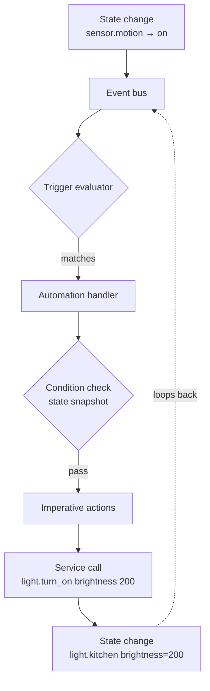
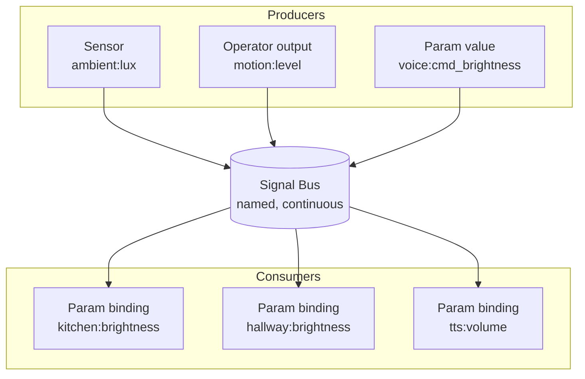
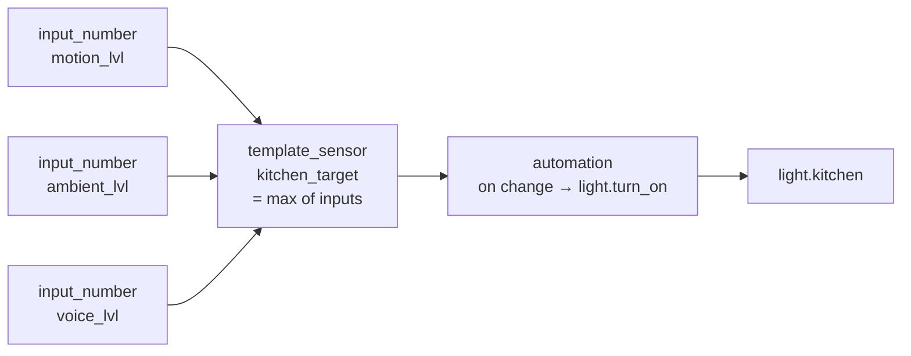
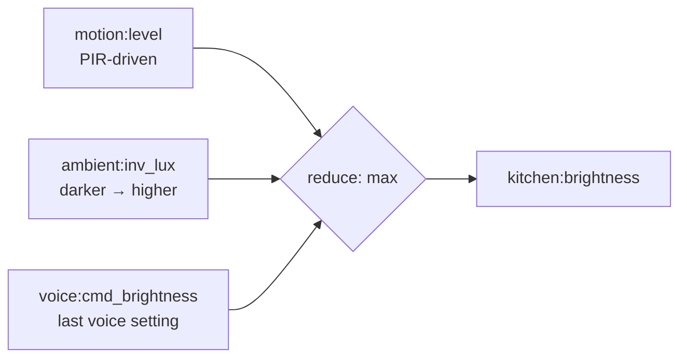
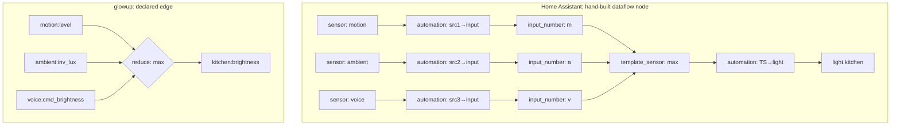
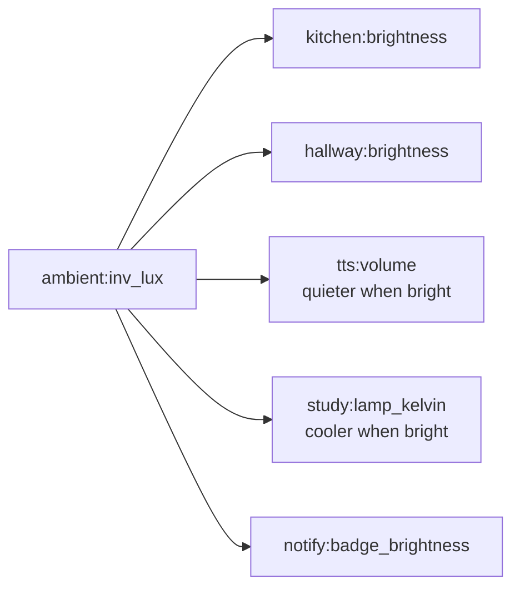

# Param-as-Signal

**A continuous-binding paradigm for home automation, and why it diverges from event-driven systems.**

---

## Abstract

Most home-automation platforms — Home Assistant, OpenHAB, SmartThings, Node-RED — implement an **event-driven** model: a state change fires an event, an automation handler runs, evaluates conditions against a snapshot of state, and imperatively writes a new value to a target. Relationships between producers and consumers are *temporal*: "when X happens, do Y." There is no standing connection between a source value and a derived value.

glowup implements a different model: **Param-as-Signal**. Every parameter on every operator is a named signal on a shared bus. A *binding* is a declarative edge that locks a target parameter to a source signal, optionally scaled and reduced. The runtime reapplies bindings on every tick. The graph of bindings *is* the program.

This paper explains the two paradigms, walks through a concrete domestic example, and argues that the difference is structural, not cosmetic — Home Assistant cannot adopt Param-as-Signal without rewriting its state machine, recorder, and entity registry. The paradigm choice is the load-bearing answer to *why glowup exists at all* in a world where Home Assistant covers most home-automation surface area.

---

## 1. The Two Paradigms

### 1.1 Event-Driven

In an event-driven automation system, the unit of behavior is the **handler**. State lives in a central store. When state changes, an event is emitted onto a bus. Handlers (HA's *automations*, Node-RED's *flows*, OpenHAB's *rules*) subscribe to events. When triggered, they evaluate conditions against the current state snapshot and execute imperative actions, which in turn write back to state and emit further events.



Templates (HA's Jinja expressions, Node-RED's function nodes) are **consumer-side** and **one-shot**: when asked for a value, they evaluate against the current state. They do not establish persistent relationships. The expression is re-fired on each ask.

Continuous behaviors must be simulated. To make `light.kitchen.brightness` track `sensor.outdoor_lux ÷ 50`, the user writes either:

- A time-triggered automation (every 30 seconds, recompute and write); or
- A state-change-triggered automation (when `outdoor_lux` changes, recompute and write); or
- A *template sensor* whose value derives from the expression, plus an automation that fires on the template sensor's change and writes to the light.

Each evaluation is an isolated event handler with no memory of the others. The relationship between `outdoor_lux` and `kitchen.brightness` exists only as a procedure that runs at trigger time. There is no first-class object representing "kitchen.brightness is a function of outdoor_lux."

### 1.2 Signal-Flow (Param-as-Signal)

In a signal-flow system, the unit of behavior is the **edge**. Sources publish values continuously onto a shared bus. Consumers declare *bindings* — standing edges from a source signal to a target parameter, optionally with a scaling map and a reducer. The runtime maintains the graph: on every tick, each bound parameter is recomputed from its sources and reapplied.



A binding is a *noun*, not a verb. There is no handler to write, no trigger to define, no condition to check. The target parameter *is* a function of its source(s); to set the parameter manually, you must first remove the binding. Replace the source and the target follows. Add a new source to the binding's reduce set and the consumer composes it in without any change to the consumer's code.

The graph composes. If `A` drives `B` and `B` drives `C`, then changes in `A` propagate to `C` automatically without any intermediate handler. Cycles are detected at *binding-creation time*, not at runtime.

---

## 2. The Home Assistant State Model

To make the comparison fair, this section describes Home Assistant's model in enough depth to show why Param-as-Signal isn't a missing feature — it's a different architecture.

### 2.1 The state machine

Home Assistant's `hass.states` object is a key-value store of `entity_id → State`, where each `State` is a value plus attributes plus a timestamp. There is exactly **one writer per entity**: the integration that owns it. When an integration calls `hass.states.async_set(entity_id, new_value)`, the store updates and an event of type `state_changed` is fired on `hass.bus`.

This single-writer assumption is foundational. The recorder, the history graphs, the UI, the templating engine — all assume that an entity's value over time is the canonical record of what that thing was. There is no concept of a value being *defined as* a function of other values.

### 2.2 Templates

HA's template engine (Jinja2 with HA-specific extensions) lets users write expressions that read state:

```jinja
{{ states('sensor.outdoor_lux') | float / 50 }}
```

But this expression has no independent existence. It lives inside an entity (a `template:` sensor) or a service-call data field, and is re-evaluated each time the surrounding context asks for a value. There is no published "binding from `outdoor_lux` to anything." There is only a consumer that, when polled, happens to read `outdoor_lux`.

The closest HA primitive to a binding is a `template:` sensor configured with `trigger:` clauses, which causes the sensor to recompute when any source changes. But the sensor is still a separate entity in the registry, with its own history, its own UI presence, and its own polling lifecycle. It is a hand-built dataflow node — by name, by hand.

### 2.3 The workaround pattern

Achieving "kitchen brightness is the maximum of three sources" in HA requires constructing the dataflow node manually:



The user has built five entities (three inputs, one template sensor, one automation) to express what is conceptually a single edge in a graph. Each entity has its own configuration, its own history record, its own UI tile, its own failure mode. None of them are reusable: if the hallway light wants the same `motion_lvl`-driven behavior, the user writes another template sensor and another automation.

This is not a defect of HA — it is the natural consequence of building dataflow on top of a single-writer state machine.

---

## 3. The glowup Signal-Flow Model

### 3.1 Operators, Params, and the bus

glowup is built around **Operators** (sensors, effects, triggers, combinators, lights). Each Operator exposes one or more **Params** — named, typed values that govern its behavior. A `breathe` effect has Params for `speed`, `brightness`, `color`. A `trigger` Operator has Params for `debounce_seconds`, `cooldown`. A `light` Operator has Params for `brightness`, `kelvin`, `hue`.

When an Operator starts, each of its Params is published onto the Signal Bus as `{operator_name}:{param_name}`. When the Param's value changes (whether from manual API call, config update, or binding resolution), the bus signal updates. Other Operators publish their *outputs* onto the bus too: a motion sensor publishes `motion:level`, an ambient light sensor publishes `ambient:lux`.

The bus is a single flat namespace. **The producer of a signal is irrelevant to its consumers.** A sensor reading, a slider value, an effect parameter, and a computed reduction are all just signals.

### 3.2 Bindings

A binding is declared on a Param:

```json
{
  "type": "light",
  "name": "kitchen",
  "bindings": {
    "brightness": {
      "signal": "ambient:inv_lux",
      "scale": [0, 255]
    }
  }
}
```

This binds `kitchen:brightness` to `ambient:inv_lux`, mapping the source's [0, 1] range to the target's [0, 255] range. The Operator's tick loop reapplies the binding every cycle. A manual `set_params(brightness=128)` call is silently overwritten on the next tick — the binding wins. To resume manual control, the binding must be removed.

For multi-source bindings, the configuration includes a reducer:

```json
{
  "bindings": {
    "brightness": {
      "sources": ["motion:level", "ambient:inv_lux", "voice:cmd_brightness"],
      "reduce": "max",
      "scale": [0, 255]
    }
  }
}
```

The reducer collapses the source set to a scalar. Supported reducers: `max`, `min`, `mean`, `sum`. The reduction is reapplied every tick.

### 3.3 Lifecycle and graph integrity

- **Late-arriving sources:** if a binding references a signal that doesn't yet exist on the bus (e.g., the motion sensor hasn't started), the target Param holds its prior value. When the source first publishes, the binding activates. No crash, no reset.
- **Disappearing sources:** if a source stops publishing, the target holds the last received value.
- **Cycle detection:** at binding-creation time, the runtime walks the dependency chain. If the chain loops back to the target, the binding is rejected with an error. There is no runtime cycle; cycles are an authoring error caught at the API boundary.
- **Restart survival:** bindings declared in config are reestablished when the Operator restarts. Runtime-created bindings (via API) are persisted alongside operator state.

### 3.4 Implementation status

The Param-as-Signal layer was built and tested in glowup as of 2026-04-12, with 51 tests covering registration, scaling, reduction, cycle detection, late sources, and restart survival. The relevant project memory is [project_param_as_signal.md](~/NAS/.claude/projects/-Users-perrykivolowitz-glowup/memory/project_param_as_signal.md).

---

## 4. Worked Example: The Kitchen Light

The kitchen light's brightness should be the **maximum** of three sources, continuously:

1. **Motion-triggered level** — 50% for 5 minutes after a PIR trip
2. **Ambient response** — brighter when the room is darker (inverse lux)
3. **Last voice command** — whatever value the user last said aloud



### 4.1 In glowup

```json
{
  "type": "light",
  "name": "kitchen",
  "bindings": {
    "brightness": {
      "sources": ["motion:level", "ambient:inv_lux", "voice:cmd_brightness"],
      "reduce": "max",
      "scale": [0, 255]
    }
  }
}
```

That is the entire program. To add a fourth source — a calendar-driven dinner-prep boost — publish it on the bus and append `"calendar:dinner_boost"` to the source list. No new entities, no new automations, no race conditions to reason about, because there are no triggers; there is only the standing edge.

### 4.2 In Home Assistant

A naive implementation writes three automations, one per source:

```yaml
automation:
  - alias: motion_kitchen
    trigger:
      platform: state
      entity_id: sensor.kitchen_motion
      to: 'on'
    action:
      service: light.turn_on
      data:
        entity_id: light.kitchen
        brightness: 128

  - alias: ambient_kitchen
    trigger:
      platform: state
      entity_id: sensor.ambient_lux
    action:
      service: light.turn_on
      data:
        entity_id: light.kitchen
        brightness: "{{ (1 - states('sensor.ambient_lux')|float / 1000) * 255 }}"

  - alias: voice_kitchen
    trigger:
      platform: state
      entity_id: input_number.voice_cmd_brightness
    action:
      service: light.turn_on
      data:
        entity_id: light.kitchen
        brightness: "{{ states('input_number.voice_cmd_brightness') }}"
```

This is **incorrect**. The three automations race. Whichever fired most recently wins, regardless of whose value is highest. If motion sets 50% and then ambient (computing 30%) fires half a second later, the kitchen drops to 30% — the opposite of "max wins."

The HA-idiomatic fix is to construct the dataflow node manually with a template sensor:

```yaml
template:
  - sensor:
      - name: kitchen_brightness_target
        state: >
          {{ [states('input_number.motion_level')|int(0),
              states('input_number.ambient_level')|int(0),
              states('input_number.voice_level')|int(0)] | max }}

automation:
  - trigger:
      platform: state
      entity_id: sensor.kitchen_brightness_target
    action:
      service: light.turn_on
      data:
        entity_id: light.kitchen
        brightness: "{{ states('sensor.kitchen_brightness_target') }}"
```

Plus three input_numbers (or three template sensors that compute each source's contribution from real sensor states), plus three small automations that update the input_numbers when the underlying sensors change.

The user has written: 3 input_numbers + 3 source-update automations + 1 template sensor + 1 binding-emulator automation = **8 entities** to express a single edge in a graph. Each entity appears in the entity registry, the history database, the UI's entity picker. None of them are reusable for the hallway light, which would need its own parallel construction.

To add a fourth source, the user edits the template expression, adds a fourth input_number, and adds a fourth source-update automation.

### 4.3 The structural difference



Same dataflow, two architectures. The HA version requires the user to be a graph compiler — to decompose a declarative edge into eight imperative entities and verify by hand that they assemble back into the intended behavior. The glowup version is the edge.

---

## 5. Why HA Cannot Bolt This On

It is tempting to imagine a HACS integration that adds Param-as-Signal to Home Assistant. The argument of this paper is that no such integration is possible without rebuilding HA's foundations. Specifically:

### 5.1 Single-writer state machine

`hass.states` assumes one writer per entity. A binding requires the runtime to *be the writer* on behalf of a graph computation, while still allowing the original integration to also write (e.g., the LIFX integration must be able to write the actual current brightness when the bulb reports state). Reconciling "the binding says X, the bulb says Y" requires a state model with multiple authoritative views of a value — which HA does not have.

### 5.2 Recorder semantics

HA's recorder writes one row per state change per entity. With a binding, what does history record? The bound output? The source values? Both? Statistics graphs assume the recorded value is the measured value; a graph showing "kitchen brightness over the last hour" would have to indicate that the value is derived, with the source's history being the actual record. This is a UX rewrite, not a config option.

### 5.3 Service call semantics

If `light.kitchen.brightness` is bound, what does `light.turn_on(brightness=200)` mean? In glowup, the binding wins; the manual call is silently superseded. In HA, every integration assumes service calls reach the device. Changing this changes the meaning of every automation in the system that ever calls `light.turn_on`.

### 5.4 Entity registry fragmentation

HA distinguishes entities, helpers (`input_number`, `input_boolean`, `input_select`), template sensors, derivative sensors, statistics sensors, and so on — each with its own config schema, its own UI tab, its own lifecycle. A binding requires these to be unified into a single namespace where a value's *source* is irrelevant to its *use*. Doing this would make most of the Helpers UI redundant.

### 5.5 Template engine direction

Templates are pull-based: a consumer asks, and the expression evaluates. Bindings are push-based: a source changes, and dependents recompute. To convert HA's templates into bindings would require flipping the dependency direction throughout the engine — the consumer no longer asks; the producer notifies, and the runtime maintains the graph.

### 5.6 Summary

These are not enhancements that could be added in a release. They are foundational shifts. The result of doing all of them would not be Home Assistant with bindings — it would be a different system that happened to run HA's integrations.

---

## 6. The Composition Advantage

The kitchen-light example shows a single edge. The deeper benefit of Param-as-Signal is that **edges compose without the user constructing intermediate scaffolding.**

Consider the consequences of having `ambient:inv_lux` on the bus once any consumer wants it:



Every additional consumer of `ambient:inv_lux` is a single binding declaration on that consumer's Param. No new automations are written; no template sensors are constructed; no entities are added to the registry. The producer publishes once; the bus distributes; every consumer that declared a binding gets the value.

In the HA model, each consumer requires its own parallel automation or template sensor. The cost of a new consumer scales linearly with the number of behaviors that depend on the source; in glowup, it is constant.

Compose this with reducers and transitive bindings — `house:occupancy ← max(motion:any, door:open, voice:active)` driving `hvac:setpoint`, `lights:dim_floor`, `alarm:armed_by`, `music:volume_floor` — and the HA equivalent becomes a wall of YAML that must be edited every time a sensor is added or a behavior changes. The glowup equivalent is a directed graph that the runtime maintains.

---

## 7. What Signal-Flow Does Not Help With

Param-as-Signal is not a panacea. Honest enumeration of its limits:

- **Discrete events.** A doorbell ringing, an SMS being sent, a door being unlocked — these are imperative actions, not continuous values. The event-driven model fits them better. glowup retains a Trigger Operator for exactly this case; bindings drive parameters, not actions.
- **Branchy stateful logic.** "If it is after 10pm and someone is upstairs and the dishwasher just finished, then announce it on the upstairs speaker only." This is a decision tree, not a signal flow. A small Combinator Operator with conditional logic is the right answer; a binding chain is not.
- **Distributed latency floor.** Bindings whose sources publish across MQTT have a one-tick (or one-broker-hop) latency floor. Fine for almost everything domestic; not fine for tight control loops at audio rate.
- **Debuggability.** The flip side of "no triggers" is "no breakpoints." Tracing why a Param has a particular value at a particular moment requires walking the binding graph, possibly across operators. A graph-visualization tool is the eventual answer; absent one, signal-flow systems can be opaque to debug.
- **Authoring barrier.** Users who expect to write `if/then` rules find themselves needing to translate behaviors into source-and-binding terms. The mental model is unfamiliar. Documentation and good defaults matter more here than in event-driven systems.

These caveats sharpen rather than weaken the case. Param-as-Signal is the correct tool for *continuous, composable, multi-source-to-multi-sink relationships*. It is not the only tool glowup needs, and it does not displace the Trigger Operator or the Combinator pattern. It coexists with them.

---

## 8. Conclusion

Home Assistant covers most of the visible surface area of home automation: device integrations, history graphs, dashboards, mobile apps, voice. The question of *why glowup exists* in a world with Home Assistant is a real one, and the answer cannot be "we have nicer dashboards" or "we have a custom MQTT topology." Those are reproducible.

What is not reproducible — at least, not without rebuilding the platform from underneath — is the substrate. HA is an **event-driven state machine with one writer per entity**; glowup is a **signal-flow graph with declarative bindings**. The two systems can interoperate (glowup's bridge to embedded HA Core is a planned project), but they cannot be merged without one absorbing the other.

The Param-as-Signal layer is the load-bearing reason glowup is its own system rather than a custom integration on top of HA. Effects, dashboards, voice, sensors — those are surface. The substrate is the bus and the bindings, and the substrate is what HA cannot have without becoming something else.

---

## Appendix A: Implementation Pointers

For readers tracing the implementation in the glowup source:

- **Operator base class** (`operators/__init__.py`): registers each Param as a bus signal at `start()`; resolves bindings on every tick; exposes `add_binding()` / `remove_binding()` / `get_bindings()`.
- **Engine** (`engine.py`): `_resolve_bindings_and_params()` runs per render frame for Effects, sharing the binding-resolution logic with the OperatorManager tick path.
- **Server routes** (`server.py`): `GET/POST/DELETE /api/signals/bindings` for runtime binding management.
- **Tests** (`tests/test_param_bindings.py`): 51 tests across 6 classes covering registration, scaling, reduction, late sources, cycle detection, restart survival, and override semantics.

## Appendix B: Glossary

- **Operator**: a runtime object that consumes input signals and produces output signals (sensors, effects, triggers, combinators, lights).
- **Param**: a named, typed value on an Operator that governs its behavior.
- **Signal Bus**: the shared, flat namespace of named values that all Operators publish to and read from.
- **Binding**: a declarative edge from a source signal (or set of sources) to a target Param, optionally with a scaling map and a reducer.
- **Reducer**: the function that collapses multiple source signals into a single value (`max`, `min`, `mean`, `sum`).
- **Tick**: the discrete time step at which the runtime reapplies bindings and calls Operators' `on_tick()` methods.

---

*Document version: 2026-04-24*
