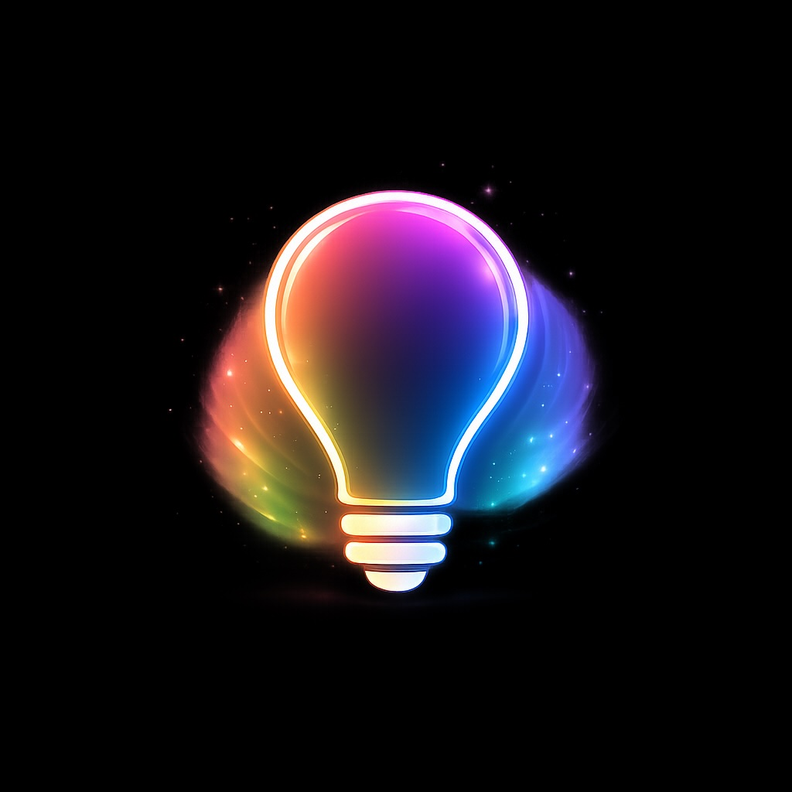

<p align="center">
  
</p>

# GLOWUP

**Sensor-driven automation platform for LIFX devices.**

GlowUp replaces fragile phone apps and cloud services with a
self-hosted platform that discovers devices, reacts to sensors,
runs on a schedule, and stays out of your way.  It scales from
"pretty lights on the porch" to a multi-machine distributed
system with BLE sensors, audio analysis, MIDI playback, and a
REST API — all from one codebase, with zero mandatory
dependencies beyond Python 3.10.

This project utilizes AI assistance (Claude 4.6) for boilerplate and
logic expansion. All architectural decisions and code integration are
by Perry Kivolowitz, the sole Human Author.

## At a Glance

| | |
|-|-|
| **33 effects** | Aurora, fireworks, Newton's Cradle, cellular automata, 199 country flags, plasma, sonar, audio spectrum, and more |
| **Sensor pipeline** | BLE motion/temperature sensors, microphone FFT, screen capture, MIDI events — all feed the same SOE (Sensor-Operator-Emitter) architecture |
| **50+ REST endpoints** | Device control, group CRUD, scheduling, automations, BLE sensors, diagnostics, device registry |
| **Self-healing discovery** | ARP-based keepalive + label-based identity.  Devices survive DHCP changes, router swaps, and power cycles without config edits |
| **780+ tests** | Audit, fuzz, concurrency, REST integration, effect contracts — gated by pre-commit hook |
| **Zero required packages** | Core is pure stdlib.  Every optional dependency (ffmpeg, paho-mqtt, bleak, etc.) is guarded and documented |

## What Do You Want to Do?

Pick what sounds like you.  Everything else is optional.

### Pretty lights from the command line

**You need:** Python 3.10+ and LIFX bulbs on your LAN.

```bash
python3 glowup.py discover                          # find devices
python3 glowup.py play aurora --ip <device-ip>      # run an effect
python3 glowup.py play cylon --sim-only --zones 36  # preview without hardware
```

See the **[Effect Gallery](https://pkivolowitz.github.io/lifx/)**
for animated previews of all 33 effects.

### Music-reactive lighting

Speak, play music, clap — the lights respond in real time.  The
CLI auto-starts your microphone via ffmpeg with no configuration.

**You need:** + ffmpeg

```bash
python3 glowup.py play spectrum2d --ip <device-ip>
python3 glowup.py play waveform --ip <device-ip>
python3 glowup.py play soundlevel --ip <device-ip>
```

### 2D matrix effects (Luna, Tiles, Candle, Ceiling)

Full pixel-grid rendering with auto-detected tile geometry.

**You need:** + a matrix device

```bash
python3 glowup.py play plasma2d --ip <luna-ip>
python3 glowup.py play matrix_rain --ip <luna-ip>
python3 glowup.py play ripple2d --ip <luna-ip>
python3 glowup.py play spectrum2d --ip <luna-ip>      # + ffmpeg for audio
```

### BLE sensor-driven automation

Bluetooth Low Energy sensors (ONVIS SMS2) publish motion,
temperature, and humidity to the automation engine via MQTT.
Trigger effects, power devices, and log events based on
occupancy and environmental state.

**You need:** + bleak, cryptography

```bash
pip install bleak cryptography
python3 -m ble.sensor --label "Hallway"
```

### Always-on server with scheduling

Headless daemon with time-based scheduling (sunrise, sunset),
REST API, SSE live updates, iOS app, device registry, group
management, diagnostics dashboard.

**You need:** *(no extra packages)*

```bash
python3 server.py server.json
```

### Virtual multizone — stitch devices into one surface

Any combination of string lights, bulbs, Neons, and beams
becomes a single animation canvas.  Effects span all devices
as one strip.

**You need:** server or local config file

```bash
python3 glowup.py play aurora --group porch
```

### MIDI-synchronized lighting

MIDI files play through speakers and synchronized lights on the
same MQTT event bus.  Multiple stations, runtime switching.

**You need:** + paho-mqtt, mosquitto, FluidSynth

```bash
python3 -m emitters.midi_out --backend fluidsynth --soundfont gm.sf2
python3 -m distributed.midi_light_bridge --ip 192.0.2.23 192.0.2.34
python3 glowup.py replay --file song.mid
```

### Write your own effects

```python
class MyEffect(Effect):
    name = "my_effect"
    speed = Param(2.0, min=0.1, max=30.0, description="Cycle speed")

    def render(self, t: float, zone_count: int) -> list[HSBK]:
        ...
```

Register it, and it's immediately available in the CLI, server,
iOS app, and scheduler.  See the **[Effect Developer Guide](docs/07-effect-dev-guide.md)**.

## Architecture

```
Sensors ──► Operators ──► Emitters
  BLE          FFT          LIFX multizone
  Mic          Beat         LIFX single
  Screen       Threshold    LIFX matrix (tiles)
  MIDI         Blend        MIDI synth
  Camera       Delay        Audio speakers
                            WebGL (browser)
```

The SOE pipeline decouples input from output.  Any sensor can
drive any effect on any emitter.  New sensors and emitters plug
in without touching the core.

## Documentation

The **[User Manual](docs/MANUAL.md)** is organized as a progressive
disclosure tree:

- **Core** — CLI, 33 effects, simulator, troubleshooting
- **Server** — REST API, scheduling, systemd/launchd
- **Remote Access** — iOS app, Cloudflare Tunnel, Home Assistant, Node-RED
- **Database** — PostgreSQL diagnostics, dashboard
- **Distributed** — MQTT, SOE pipeline, audio/MIDI pipelines
- **Developer** — effects, sensors, operators, emitters

<p align="center">
  
</p>

## Requirements

The core requires **only Python 3.10+ and LIFX bulbs**.
Everything else is opt-in:

| Feature | Additional packages |
|---------|-------------------|
| Audio-reactive effects | ffmpeg |
| Recording to GIF/MP4 | ffmpeg |
| BLE sensors | bleak, cryptography |
| Screen-reactive lighting | pygame |
| Server + scheduling | *(none)* |
| Distributed / MQTT | paho-mqtt, mosquitto |
| MIDI pipeline | paho-mqtt, pyfluidsynth, python-rtmidi |
| Database / dashboard | psycopg2 |
| Vision / camera | opencv-python |

Full details: **[Requirements](docs/02-requirements.md)**

## Caveat

Tested with LIFX string lights, Neon, Luna (700-series matrix),
and monochrome bulbs.  Please report problems — I don't own
every LIFX product.  Fixes for other devices are welcome.

## License

MIT

## Appreciation

> If you find this software useful, please consider donating to a local food pantry.  Even a single can of soup makes someone in your neighborhood's day a little easier.
